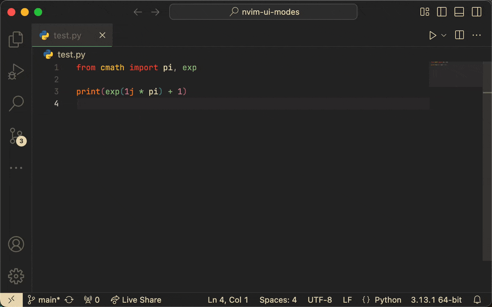

# NeoVim UI Modes

Enhance your coding experience with the NeoVim UI Modes extension for Visual Studio Code! This extension dynamically adjusts your UI colors based on the current NeoVim mode, providing a seamless and immersive editing environment.



---

## ✨ Features

- **Dynamic UI Colors**: Automatic adjustment of UI colors based on NeoVim modes.
- **Seamless Integration**: Works effortlessly with the `vscode-neovim` extension.
- **Fully Customizable**: Personalize colors for every mode to match your preferences.

### Modes Supported

- **Normal Mode**
- **Insert Mode**
- **Visual Mode**
- **Replace Mode**
- **Command Mode**

---

## 📋 Requirements

To use this extension, ensure the following requirements are met:

- **Visual Studio Code**: Version 1.96.0 or later.
- **NeoVim Integration**: Use a plugin like `vscode-neovim` for communication between VS Code and NeoVim.

---

## ⚙️ Configuration

### 1. Customize UI Colors in VS Code

Modify your `settings.json` file to set custom colors for each NeoVim mode:

```json
"nvim-theme.ColorCustomizationsByModes":{
  "normal": {
    "editorCursor.foreground": "#e9dbb7",
    "activityBarBadge.background": "#e9dbb7",
    "activityBarBadge.foreground": "#252525",
    "statusBar.background": "#252525",
    "statusBar.foreground": "#e9dbb7"
  },
  "command": {
    "editorCursor.foreground": "#e9dbb7",
    "activityBarBadge.background": "#252525",
    "activityBarBadge.foreground": "#e9dbb7",
    "statusBar.background": "#e9dbb7",
    "statusBar.foreground": "#252525"
  },
  "insert": {
    "editorCursor.foreground": "#ef857d",
    "activityBarBadge.background": "#e9dbb7",
    "activityBarBadge.foreground": "#252525",
    "statusBar.background": "#a87673",
    "statusBar.foreground": "#252525"
  },
  "visual": {
    "editorCursor.foreground": "#3e97f7",
    "activityBarBadge.background": "#e9dbb7",
    "activityBarBadge.foreground": "#252525",
    "statusBar.background": "#83a3c9",
    "statusBar.foreground": "#252525"
  },
  "replace": {
    "editorCursor.foreground": "#72f59c",
    "activityBarBadge.background": "#e9dbb7",
    "activityBarBadge.foreground": "#252525",
    "statusBar.background": "#c0dcb8",
    "statusBar.foreground": "#252525"
  }
}
```

### Supported UI Elements

You can customize these and more UI elements:

- `activityBarBadge.background`
- `editorCursor.foreground`
- `statusBar.background`
- `statusBar.foreground`
- `panel.border`
- `tab.activeBorder`
- See more in the [VS Code Theme Color Reference](https://code.visualstudio.com/api/references/theme-color).

> **Note**: These customizations overwrite existing `workbench.colorCustomizations`.

---

### 2. Sync NeoVim Modes with VS Code

#### Example for `init.lua`

```lua
local vscode = require("vscode")

local function send_mode()
    local mode = vim.api.nvim_get_mode().mode
    if mode == "i" or mode == "" then
        vscode.call("nvim-theme.insert")
    elseif mode == "c" then
        vscode.call("nvim-theme.command")
    elseif mode == "R" then
        vscode.call("nvim-theme.replace")
    elseif mode == "n" then
        vscode.call("nvim-theme.normal")
    elseif mode == "V" or mode == "v" or mode == "^V" then
        vscode.call("nvim-theme.visual")
    end
end

send_mode()
vim.api.nvim_create_autocmd({ "InsertEnter", "InsertLeave", "ModeChanged" }, {
    callback = function()
        send_mode()
    end,
})
```

#### Example for `init.vim`

```vim
function! SendMode()
  let mode = mode()
  if mode ==# 'i' || mode ==# ''
    call VSCodeCall('nvim-theme.insert')
  elseif mode ==# 'c'
    call VSCodeCall('nvim-theme.command')
  elseif mode ==# 'R'
    call VSCodeCall('nvim-theme.replace')
  elseif mode ==# 'n'
    call VSCodeCall('nvim-theme.normal')
  elseif mode ==# 'V' || mode ==# 'v' || mode ==# '^V'
    call VSCodeCall('nvim-theme.visual')
  endif
endfunction

call SendMode()

augroup ModeChange
  autocmd!
  autocmd InsertEnter,InsertLeave,ModeChanged * call SendMode()
augroup END
```

---

## 🚨 Warnings

- When uninstalling this extension, clean up overridden keys in your `settings.json` under `workbench.colorCustomizations`.

---

## ❤️ Support the Project

If you find this extension helpful, consider supporting its development:

### 💸 Donate

- **BTC Address**: `bc1qajl9nu6slw0gevk2vhl2qh0u3nepndf786g400`
- **PayPal**: [paypal.me/aismith42](https://paypal.me/aismith42)

---

Thank you for your support! Your contributions help keep this project alive. 😊

