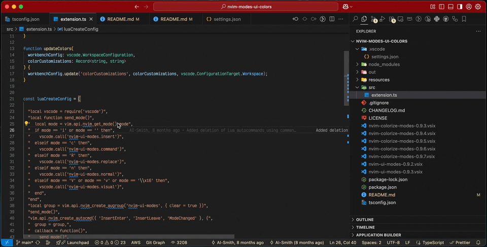

# NeoVim UI Colorizer

<a href="https://www.buymeacoffee.com/kaustubhw" target="_blank"></a>

### [Install from VSCode Marketplace](https://marketplace.visualstudio.com/items?itemName=KaustubhWalokar.nvim-colorize-modes)

Enhance your coding experience with the NeoVim UI Modes extension for Visual Studio Code! This extension dynamically adjusts your UI colors based on the current NeoVim mode, providing a seamless and immersive editing environment. This extension works well with the [Window Colors extension](https://marketplace.visualstudio.com/items?itemName=stuart.unique-window-colors) to allow for the window titlebar colors to be updates.

This is a fork of the [original](https://marketplace.visualstudio.com/items?itemName=AI-Smith.nvim-ui-modes) extension from here with some tweaks to make it work with other extenstions which modify the vscode ui element colors



---

## ✨ Features

- **Dynamic UI Colors**: Automatic adjustment of UI colors based on NeoVim modes.
- **Seamless Integration**: Works effortlessly with the `vscode-neovim` extension.
- **Fully Customizable**: Personalize colors for every mode to match your preferences.

### Modes Supported

- **Normal Mode**
- **Insert Mode**
- **Visual Mode**
- **Replace Mode**
- **Command Mode**

---

## 📋 Requirements

To use this extension, ensure the following requirements are met:

- **Visual Studio Code**: Version 1.96.0 or later.
- **NeoVim Integration**: Use a plugin like `vscode-neovim` for communication between VS Code and NeoVim.

---

## ⚙️ Configuration

### 1. Customize UI Colors in VS Code

Modify your `settings.json` file to set custom colors for each NeoVim mode:

```json
"nvim-ui-modes.ColorCustomizationsByModes": {
    "normal": {
        "editorCursor.foreground": "#e9dbb7",
        "activityBarBadge.background": "#e9dbb7",
        "activityBarBadge.foreground": "#252525",
        "statusBar.background": "#252525",
        "statusBar.foreground": "#e9dbb7"
    },
    "command": {
        "editorCursor.foreground": "#e9dbb7",
        "activityBarBadge.background": "#252525",
        "activityBarBadge.foreground": "#e9dbb7",
        "statusBar.background": "#e9dbb7",
        "statusBar.foreground": "#252525"
    },
    "insert": {
        "editorCursor.foreground": "#ee7f77",
        "activityBarBadge.background": "#e9dbb7",
        "activityBarBadge.foreground": "#252525",
        "statusBar.background": "#8d504c",
        "statusBar.foreground": "#e9dbb7"
    },
    "visual": {
        "editorCursor.foreground": "#56a4f6",
        "activityBarBadge.background": "#e9dbb7",
        "activityBarBadge.foreground": "#252525",
        "statusBar.background": "#415a81",
        "statusBar.foreground": "#e9dbb7"
    },
    "replace": {
        "editorCursor.foreground": "#6af596",
        "activityBarBadge.background": "#e9dbb7",
        "activityBarBadge.foreground": "#252525",
        "statusBar.background": "#39817f",
        "statusBar.foreground": "#e9dbb7"
    }
}
```

### Supported UI Elements

You can customize these and more UI elements:

- `activityBarBadge.background`
- `editorCursor.foreground`
- `statusBar.background`
- `statusBar.foreground`
- `panel.border`
- `tab.activeBorder`
- See more in the [VS Code Theme Color Reference](https://code.visualstudio.com/api/references/theme-color).

> **Note**: These customizations overwrite existing `workbench.colorCustomizations`.

---

## 🚨 Warnings

- When uninstalling this extension, clean up overridden keys in your `settings.json` under `workbench.colorCustomizations`.

---

## ❤️ Support the Project

If you find this extension helpful, consider supporting its development:

<a href="https://www.buymeacoffee.com/kaustubhw" target="_blank"></a>

---

Thank you for your support! Your contributions help keep this project alive. 😊
